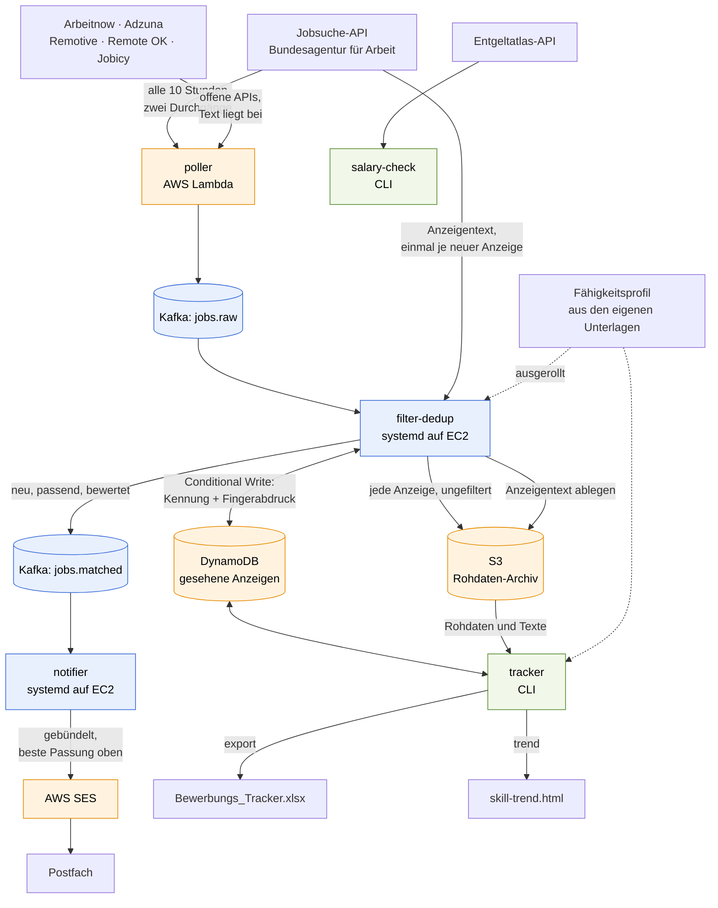
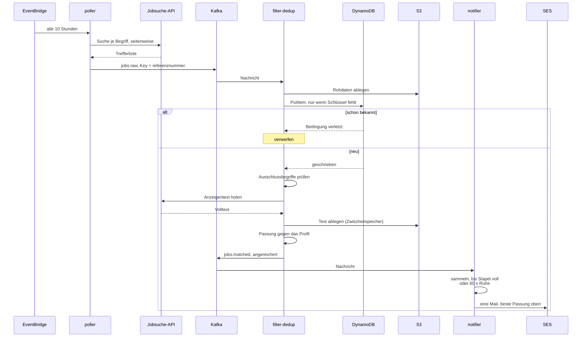
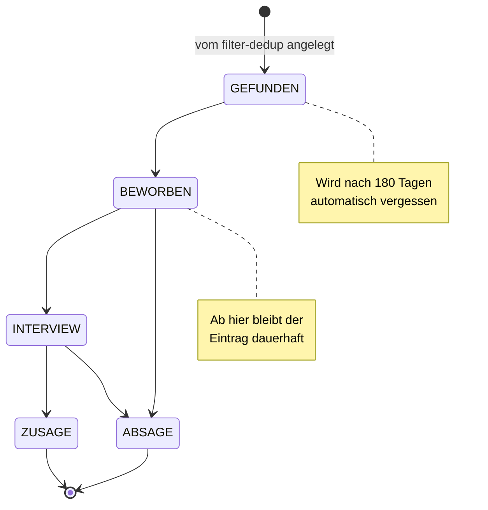

# JobRadar

Event-getriebene Pipeline, die neue Stellenanzeigen im Raum Hamburg
erkennt, dedupliziert und gebündelt per E-Mail meldet. Dazu zwei
Werkzeuge für die Zeit danach: ein Bewerbungs-Tracker und ein
Gehaltsabgleich.

Portfolio- und Lernprojekt für Terraform, Kafka und AWS – gebaut auf
einem Free-Tier-Konto, mit entsprechend bewussten Entscheidungen bei
jeder Ressource.

## Status

Die Pipeline läuft durchgängig von der API bis zur E-Mail.

| Baustein | Stand |
|----------|-------|
| Terraform: VPC, EC2, DynamoDB, S3, SES, Budget | fertig |
| Kafka 4.x (KRaft) auf t3.micro, SASL_SSL mit eigener CA | fertig |
| `poller` als Lambda, alle 10 Stunden | fertig |
| `filter-dedup` und `notifier` als Dienste auf der Instanz | fertig |
| `tracker`: Bewerbungsstatus verwalten | fertig |
| `tracker export`: Bewerbungstabelle befüllen | fertig |
| `tracker profil`: Passung zum eigenen Profil | fertig |
| `salary-check`: Abgleich mit dem Entgeltatlas | fertig |
| Passung und Randdaten in der Benachrichtigungsmail | fertig |
| `tracker trend`: Skill-Trend über das Archiv | fertig |
| Sechs Stellenbörsen statt einer, quellenübergreifend dedupliziert | fertig |
| Status per Auswahlfeld in der Tabelle, Rückweg nach DynamoDB | fertig |
| Homeoffice-Angabe aus dem Anzeigentext statt aus leeren Feldern | fertig |
| `tracker rueckblick`: Punktzahl gegen tatsächlichen Ausgang | fertig |
| `tracker warum` / `faellig`: Fehlersuche und offene Bewerbungen | fertig |

335 Tests über sechs Services, alle ohne Netzzugriff lauffähig.

## Architektur



Alle AWS-Ressourcen entstehen über Terraform. Das Setup ist bewusst
Single-AZ, ohne NAT Gateway und ohne Amazon MSK.

### Woher die Anzeigen kommen

Sechs Börsen, je eine Datei in
[`services/poller/poller/quellen/`](services/poller/poller/quellen/):

| Name | Bestand | Zugangsdaten |
|------|---------|--------------|
| `arbeitsagentur` | Hamburg + bundesweit remote | – |
| `arbeitnow` | Deutschland | – |
| `adzuna` | Deutschland, Aggregator | kostenlose Registrierung |
| `remotive` | weltweit remote | – |
| `remoteok` | weltweit remote | – |
| `jobicy` | remote, Region Deutschland | – |

Alle übersetzen ihr Ergebnis in **das Format der Jobsuche-API**, damit
flussabwärts — Filter, Anreicherung, Mail, Export — nichts unterschieden
werden muss. Eine neue Quelle ist damit genau eine Datei.
Auswahl über `POLLER_QUELLEN`; fällt eine aus oder bremst sie mit
HTTP 429, macht der Poller mit den übrigen weiter.

Gesucht wird nach `Data Engineer`, `Softwareentwickler`,
`Software Engineer`, `Developer` und `Java`. Bei der Bundesagentur ist
jeder Begriff eine eigene Suche, bei den übrigen ein Filter auf den
Titel — dort auf Teilzeichenketten, damit `entwickler` auch
`Softwareentwickler` findet. Nennt ein Begriff eine Fähigkeit aus dem
Verzeichnis, gilt stattdessen deren geprüftes Muster: `Java` trifft so
nicht `JavaScript`.

**LinkedIn, Indeed, StepStone und get-in-it sind nicht dabei.** Ihre
Nutzungsbedingungen untersagen automatisiertes Auslesen, und sie setzen
das auch durch — ein Scraper wäre ein absehbar gesperrter Poller.
Begründung und verworfene Alternativen in
[ADR 0009](docs/adr/0009-mehrere-stellenboersen.md).

### Dieselbe Stelle auf drei Portalen

Die Referenznummer ist nur *innerhalb* einer Quelle eindeutig. Dazu kommt
deshalb ein **inhaltlicher Fingerabdruck** aus Arbeitgeber, Titel und
Ort, normalisiert:

```
"Data Engineer (m/w/d)"   ≙  "Data Engineer (w/m/d)"
"Beispiel GmbH & Co. KG"  ≙  "Beispiel GmbH"
"20095 Hamburg"           ≙  "Hamburg, Deutschland"
```

Erfahrungsstufen bleiben unterscheidbar: „Senior Data Engineer" ist eine
andere Stelle als „Data Engineer". Geprüft wird im Poller (innerhalb
eines Laufs) und im `filter-dedup` (über Läufe hinweg) — dort als zweiter
bedingter Schreibvorgang gegen dieselbe Tabelle, unter dem Schlüssel
`fp#<abdruck>`. Kein neues Schema, kein zusätzlicher Index.

### Was gesucht und was aussortiert wird

Bei der Bundesagentur sucht der Poller in **zwei Durchgängen**:

1. **Im Umkreis von Hamburg** (30 km), unabhängig davon, ob Homeoffice
   angeboten wird.
2. **Bundesweit**, aber nur Anzeigen mit `homeofficeprozent >= 100` –
   also solche, die vollständig aus dem Homeoffice zu erledigen sind.
   Dort spielt der Arbeitsort keine Rolle.

Gepollt wird **alle zehn Stunden**. Bei rund anderthalb neuen Anzeigen
pro Tag reicht das aus und schont eine Schnittstelle, hinter der kein
Vertrag steht. Das Suchfenster von sieben Tagen liegt weit darüber – ein
ausgefallener Lauf geht also nicht verloren.

`homeofficetyp: NACH_VEREINBARUNG` zählt dabei **nicht** als remote. Der
Wert sagt nur, dass darüber gesprochen werden kann; für eine Stelle am
anderen Ende der Republik ist das keine Grundlage. Details in
[ADR 0006](docs/adr/0006-bundesweite-remote-stellen.md).

Anschließend wirft der `filter-dedup` alles heraus, dessen Titel oder
Berufsbezeichnung einen Ausschlussbegriff enthält. Voreingestellt sind
drei Gruppen:

| Gruppe | Begriffe |
|--------|----------|
| Einstiegsstellen | `praktikum`, `werkstudent`, `ausbildung`, `minijob`, `aushilfe`, `schulpraktikum` |
| Erfahrungsstufe | `senior`, `sr` |
| Führungsrollen | `lead`, `teamlead`, `leiter`, `teamleiter`, `principal`, `staff`, `head of` |

Verglichen wird auf den **Wortanfang**, nicht irgendwo im Text. Das ist
der Unterschied zwischen „`sr`" als Abkürzung für Senior und dem `sr` in
„I**sr**ael" – und es sorgt zugleich dafür, dass `praktikum` weiterhin
auch „Praktikumsstelle" erfasst, weil nur der Wortanfang gebunden ist.

Deshalb stehen `lead` und `teamlead` beide auf der Liste: In „Teamlead"
beginnt kein Wort mit `lead`. Bewusst **nicht** dabei ist `manager` – der
Begriff kommt auch in „Junior Customer Success Manager" vor und würde
Einstiegsstellen aussortieren.

Zu ändern in `scripts/deploy-consumers.sh` über `MATCH_AUSSCHLUSS`.
Optional lässt sich mit `MATCH_PFLICHT` zusätzlich verlangen, dass
mindestens einer von mehreren Begriffen vorkommt.

## Was bei einem Durchlauf passiert



Der entscheidende Schritt ist der bedingte Schreibvorgang gegen
DynamoDB. Erst `GetItem` und dann `PutItem` hätte eine Lücke: zwei
Consumer könnten dieselbe Anzeige gleichzeitig für neu halten. Der
bedingte Schreibvorgang ist atomar – schlägt die Bedingung fehl, war die
Anzeige bereits erfasst.

Offsets werden erst nach erfolgreicher Verarbeitung bestätigt. Stürzt
ein Dienst ab, wird die Nachricht erneut zugestellt; weil die
Deduplizierung eine Wiederholung folgenlos macht, ist das unkritisch.

Alle Befehle, Schalter, Umgebungsvariablen und festen Begriffe stehen
gesammelt in [docs/befehle.md](docs/befehle.md) — dort auch in der
PowerShell-Fassung. Zwei Dinge, über die man sonst als Erstes stolpert:

* Die lokalen Werkzeuge brauchen die **virtuelle Umgebung**
  (`source .venv/bin/activate`, unter Windows `.\.venv\Scripts\Activate.ps1`).
  Ohne sie fehlt `boto3`.
* Die Beispiele hier sind Bash. Unter Windows heißt `export NAME=wert`
  entsprechend `$env:NAME = wert`.

## Repo-Struktur

| Pfad | Inhalt |
|------|--------|
| `infra/` | Terraform: `vpc`, `ec2-kafka`, `lambda-poller`, `storage`, `ses`, `budget` |
| `services/poller/` | Lambda: fragt sechs Stellenbörsen ab, published nach Kafka |
| `services/filter-dedup/` | Consumer: Dedup gegen DynamoDB, Archiv nach S3, Filter, Anreicherung |
| `services/notifier/` | Consumer: bündelt Treffer, versendet über SES |
| `services/gemeinsam/` | Verzeichnis, Profil, Bewertung, Archivzugriff – von `filter-dedup` und `tracker` benutzt |
| `services/tracker/` | CLI: Status verwalten, Export, Passungsbewertung, Skill-Trend |
| `bewerbung/` | eigene Unterlagen und das Profil. Nicht im Repo, siehe `.gitignore` |
| `dashboards/` | erzeugte Berichte. Ebenfalls nicht im Repo |
| `services/salary-check/` | CLI: Gehaltsabgleich über den Entgeltatlas |
| `scripts/` | Ausrollen der Consumer auf die Instanz |
| `docs/adr/` | Architekturentscheidungen mit Begründung |
| `docs/befehle.md` | Nachschlagewerk: alle Befehle, Schalter und Begriffe |

## Einrichten

Benötigt: Terraform, AWS CLI, Python 3.13.

```bash
cp infra/terraform.tfvars.example infra/terraform.tfvars
```

Darin gehören die eigene öffentliche IP (`curl -s https://checkip.amazonaws.com`)
für den SSH-Zugang und die E-Mail-Adresse für Budget-Warnungen und
Benachrichtigungen. Dann:

```bash
python services/poller/build.py          # Lambda-Paket bauen
terraform -chdir=infra init
terraform -chdir=infra apply
bash scripts/deploy-consumers.sh         # Consumer auf die Instanz
```

AWS schickt zwei Bestätigungsmails – eine für das Budget, eine für die
SES-Adresse. Beide müssen quittiert werden, sonst bleiben Warnungen und
Benachrichtigungen aus.

## Betrieb

| Teil | Wo | Auslöser |
|------|----|----------|
| `poller` | Lambda | EventBridge, alle 10 Stunden |
| `filter-dedup` | systemd auf der EC2 | wartet auf `jobs.raw` |
| `notifier` | systemd auf der EC2 | wartet auf `jobs.matched` |

```bash
# Dienste beobachten
ssh ec2-user@$(terraform -chdir=infra output -raw kafka_public_dns)
sudo journalctl -u jobradar-filter-dedup -f

# Poller von Hand auslösen
aws lambda invoke --function-name jobradar-poller antwort.json
aws logs tail /aws/lambda/jobradar-poller --since 10m --format short

# nach einer Codeänderung
bash scripts/deploy-consumers.sh                     # Consumer
python services/poller/build.py && terraform -chdir=infra apply   # Poller
```

Tests laufen ohne Netzzugriff, je Service einzeln:

```bash
python -m pytest services/poller
python -m pytest services/filter-dedup
```

## Bewerbungen verfolgen

Der Tracker arbeitet auf derselben DynamoDB-Tabelle, in die der
Dedup-Schritt jede gefundene Anzeige schreibt.



```bash
export DYNAMODB_TABLE_SEEN_JOBS=$(terraform -chdir=infra output -raw dedup_table_name)
cd services/tracker

python -m tracker.main liste
python -m tracker.main liste --status BEWORBEN
python -m tracker.main zeige 10001-1003552327-S
python -m tracker.main setze 10001-1003552327-S BEWORBEN
```

Sobald eine Anzeige den Zustand `GEFUNDEN` verlässt, wird ihre
Aufbewahrungsfrist aufgehoben. Eine laufende Bewerbung soll nicht nach
180 Tagen still aus der Tabelle verschwinden, während reine Fundstücke
sich weiterhin selbst abräumen.

## In die Bewerbungstabelle exportieren

Der Tracker schreibt die gefundenen Anzeigen in eine Excel-Datei mit den
Spalten, die eine Bewerbungsübersicht üblicherweise hat. Die Datei wird
**ergänzt, nicht ersetzt** – eigene Eintragungen bleiben stehen.

```bash
export DYNAMODB_TABLE_SEEN_JOBS=$(terraform -chdir=infra output -raw dedup_table_name)
export S3_BUCKET_RAW_ARCHIVE=$(terraform -chdir=infra output -raw archive_bucket_name)
cd services/tracker

python -m tracker.main export --datei ~/Bewerbungs_Tracker.xlsx
python -m tracker.main export --datei ~/Bewerbungs_Tracker.xlsx --status BEWORBEN
```

Die Tabelle ist **Ausgabe und Eingabe zugleich**. Die Spalte `Status` ist
ein Auswahlfeld; der Export liest die Auswahl zurück nach DynamoDB, bevor
er von dort zurückschreibt:

| Auswahl | Wirkung |
|---------|---------|
| *(leer)* | noch nichts entschieden |
| `Abgeschickt` · `Interview` · `Zusage` | nach oben zu den laufenden Bewerbungen |
| `Absage` | ans Ende |
| `Nicht interessant` | verschwindet beim nächsten Export |

Sortiert wird in drei Blöcken: laufende Bewerbungen zuerst, dann alles
Unberührte nach Passung, ganz unten die Absagen. Jeder Lauf ordnet neu,
die `Nr.` ist damit der aktuelle Rang.

Gestaltet wird bei jedem Lauf: einheitliche Zeilenhöhe (so hoch, wie es
die vollste Zelle braucht – nichts wird abgeschnitten), Farbe nach
Passung und Status als bedingte Formatierung, feste erste Spalten und ein
Autofilter über den ganzen Bereich.

Ausgeblendete Anzeigen bleiben in DynamoDB – sonst tauchte dieselbe
Stelle beim nächsten Lauf wieder auf.

Anzeigen, deren **Titel** unter den Pipeline-Ausschluss fällt (`senior`, `lead`,
`praktikum` … – die Liste aus `MATCH_AUSSCHLUSS`), kommen nicht in die Tabelle:
der Dedup-Schritt schreibt jede gesehene Anzeige nach DynamoDB, auch die vom
Filter verworfenen, und der Export wendet denselben Maßstab noch einmal an.
`--mit-aussortierten` zeigt sie trotzdem.

Drei Quellen fließen zusammen: der Tabelleneintrag aus DynamoDB, die
archivierten Rohdaten aus S3 und – je Anzeige einmal – die Detailansicht
der Jobsuche. Kein Sprachmodell, keine Kosten pro Anzeige; alles ist
Feldzuordnung und Mustersuche.

### Woher die Spalten kommen

| Spalte | Quelle |
|--------|--------|
| Firma, Position, Standort | Rohdaten aus dem Archiv |
| Homeoffice-Modell | `homeofficeprozent`, sonst der Anzeigentext, sonst `homeofficetyp` |
| Link zur Ausschreibung | Referenznummer, bei fremden Quellen deren eigene Adresse |
| Status | Auswahlfeld – **du** füllst es, der Export liest es zurück |
| Quelle | welche Börse die Anzeige gemeldet hat |
| Gehalt | Angabe der Anzeige, Tarifvertrag, sonst Betrag oder Entgeltgruppe aus dem Text |
| Benefits | Stichwortverzeichnis über den Anzeigentext |
| Kontakt | Ansprechpartner und E-Mail/Telefon aus dem Anzeigentext |
| Alter (Tage) | Tage seit der Veröffentlichung |
| Entfernung (km) | von der Bundesagentur, sonst Luftlinie aus dem Ortsnamen |
| Passung, Punkte, Treffer, Lücken | Abgleich mit dem eigenen Profil, siehe unten |

### Was ein zweiter Lauf anfasst

Ein Export, der die Datei jedes Mal neu schriebe, wäre nach der ersten
eigenen Eintragung unbrauchbar. Deshalb drei Stufen:

| Stufe | Spalten | Verhalten |
|-------|---------|-----------|
| automatisch | Nr., Passung, Punkte, Treffer, Lücken, Firma, Position, Standort, Homeoffice-Modell, Alter, Entfernung, Link, Status, Quelle | wird jedes Mal überschrieben |
| Vorschlag | Gehalt, Benefits, Kontakt | nur eingetragen, solange die Zelle leer ist |

Handgepflegte Spalten gibt es nicht mehr: Termine und Notizen von Hand
nachzutragen war Arbeit, die niemand macht. Was wirklich zählt – seit wann
eine Bewerbung läuft – steht ohnehin in DynamoDB und beantwortet
`tracker faellig`.

Ein leerer Wert löscht nie etwas Vorhandenes – eine ausgefallene Quelle
soll keine Daten kosten. Mit `--ueberschreiben` werden auch die
Vorschläge erneuert.

Zugeordnet wird über die **Überschriften** der ersten Zeile, nicht über
die Spaltenposition. Eine umsortierte oder um eigene Spalten erweiterte
Tabelle bleibt lesbar, fremde Spalten bleiben unberührt. Welche Zeile zu
welcher Anzeige gehört, hält eine ausgeblendete Spalte `Referenz` fest;
beim ersten Lauf gegen eine von Hand geführte Tabelle genügt der
eingefügte Link oder die Kombination aus Firma und Position.

Mit Profil sortiert der Export die Zeilen am Ende nach Passung (beste
zuerst, innerhalb einer Stufe nach Punkten). Sortiert wird die volle
Zeilenbreite, damit Handeinträge und fremde Spalten bei ihrer Anzeige
bleiben; zeilenbezogene Handformatierung übersteht das Umsortieren
allerdings nicht.

Vor jedem Schreiben entsteht eine Sicherung neben der Datei. openpyxl
liest die Mappe ein und schreibt sie vollständig neu – Diagramme, Bilder
und Pivot-Tabellen überleben das nicht.

### Anzeigentexte

Die Trefferliste der Jobsuche enthält keinen Anzeigentext (ADR 0001).
Kontakt, Benefits, eine etwaige Gehaltsangabe und – vor allem – die
Grundlage der Passungsbewertung kommen deshalb aus `/pc/v4/jobdetails/`,
das je Anzeige **einmal** abgefragt und anschließend unter `detail/` im
Archiv abgelegt wird. Ein zweiter Export belastet die Schnittstelle nicht
erneut – dieselbe Zurückhaltung, aus der auch der Poller nur alle zehn
Stunden läuft.

Das Beschreibungsfeld heißt inzwischen `stellenangebotsBeschreibung` (bis
vor Kurzem `stellenbeschreibung`); beide Namen werden gelesen, wie in
ADR 0001 für solche Feldwechsel vorgesehen.

Zurückgezogene Anzeigen antworten mit 404. Das ist beim Export der
Normalfall und kein Fehler: das Archiv reicht 180 Tage zurück, eine
Anzeige selten so lange. Auch dieses leere Ergebnis wird gemerkt, sonst
fragte jeder weitere Lauf erneut nach. `--details-erneuern` holt sie
trotzdem neu, `--ohne-details` verzichtet ganz darauf – dann bleibt die
Passung allerdings bei „zu wenig Angaben".

Eine Gehaltsschätzung aus dem Entgeltatlas trägt der Export **nicht** mehr
ein: der Median war für alle Anzeigen einer Berufsklasse derselbe und
sagte nichts über die konkrete Stelle
([ADR 0005](docs/adr/0005-gehaltsabgleich-ueber-den-entgeltatlas.md),
[ADR 0008](docs/adr/0008-tabelle-nach-passung-sortiert.md)). Für eine
gezielte Einordnung bleibt `salary-check` als eigenes Werkzeug. Dass die
Anzeigen selbst schweigen, ist der Regelfall: `verguetungsangabe` steht
bei den beobachteten Treffern durchgängig auf `KEINE_ANGABEN`.

## Passung zum eigenen Profil

Der Export kann jede Anzeige danach einstufen, wie gut sie zu den
eigenen Fähigkeiten passt. Grundlage ist ein Profil, das aus den eigenen
Unterlagen entsteht.

```bash
cd services/tracker

python -m tracker.main profil            # aus bewerbung/ lesen und ablegen
python -m tracker.main profil --anzeigen # nur ausgeben
```

```
Gelesen: Lebenslauf.pdf
Geschrieben: bewerbung/profil.json

Programmiersprachen    Java*, Python, JavaScript*, TypeScript*, SQL
Frameworks             Spring*, React*, Maven, REST-APIs
Cloud und Betrieb      GCP, Docker, CI/CD, GitLab*, Git, Linux, Monitoring*
...
28 Fähigkeiten, davon 8 Schwerpunkte (*)
```

Liegt `bewerbung/profil.json` vor, ergänzt der Export vier Spalten:

| Spalte | Inhalt |
|--------|--------|
| Passung | die Stufe |
| Punkte | Deckung in Prozent, als Zahl zum Sortieren |
| Treffer | welche Anforderungen das Profil abdeckt, Schwerpunkte mit `*` |
| Lücken | welche nicht |

Vier Stufen, die in dieser Reihenfolge sortieren:

| Stufe | ab | Bedeutung |
|-------|----|-----------|
| `A – Volltreffer` | 60 Punkte | deckt den Großteil der Anforderungen |
| `B – Naheliegend` | 35 Punkte | solide Schnittmenge, Lücken schließbar |
| `C – Randbereich` | darunter | wenig Überschneidung |
| `D – zu wenig Angaben` | – | kein Urteil über die Stelle, sondern über die Datenlage |

`D` entsteht, wenn die Anzeige weniger als drei bekannte Begriffe nennt.
Bei einer Anzeige, die nur „Java" erwähnt, wäre jede Prozentzahl Zufall –
ein einziger Treffer ergäbe glatte 100. Ohne `--ohne-details` kommt das
selten vor; mit ihm fast immer, weil dann nur der Titel vorliegt.

### Wie die Punktzahl entsteht

Die Zahl ist die **Deckung**: welcher Anteil dessen, was die Anzeige
verlangt, im Profil steht. Begriffe im **Titel** zählen dreifach – „Java
Entwickler" sagt mehr über die Stelle aus als eine Erwähnung von Java
irgendwo im Fließtext.

Ob ein Treffer einen eigenen Schwerpunkt betrifft, geht bewusst **nicht**
in die Zahl ein. Ein Bonus dafür war zuerst drin und hat die Bewertung an
der Spitze unbrauchbar gemacht: zwei sehr verschiedene Anzeigen kamen
beide auf abgeschnittene 100. Ohne ihn stehen dort 94, 92 und 88 – und
die Unterscheidung ist trotzdem sichtbar, nämlich als Stern in der
Trefferspalte.

Die Schwellen sind gesetzt, nicht gemessen. Sie gehören nachjustiert,
sobald genug bewertete Anzeigen vorliegen.

### Das Profil gehört nachgebessert

Eine Mustersuche findet, was dasteht. Ein Lebenslauf erwähnt manches nur
beiläufig, was in Wahrheit im Zentrum steht – und schweigt über Dinge,
die man längst kann. Deshalb hat `profil.json` zwei Listen für Eingriffe
von Hand:

```json
{
  "eigene": ["Kafka", "AWS", "Terraform", "DynamoDB"],
  "ausgeschlossen": ["Oracle"]
}
```

`eigene` ergänzt, `ausgeschlossen` streicht; beide zählen als
Schwerpunkt und überleben ein erneutes Einlesen. Gültige Bezeichnungen
stehen in [faehigkeiten.py](services/tracker/tracker/faehigkeiten.py) –
ein Tippfehler wird beim Laden gemeldet, statt still wirkungslos zu
bleiben.

Wie viel das ausmacht, zeigt eine Data-Engineer-Anzeige mit Kafka, AWS
und Terraform gegen einen Lebenslauf, in dem nichts davon steht – obwohl
dieses Repo aus genau diesen Bausteinen besteht:

```
Lebenslauf wie er ist      C – Randbereich   20 Punkte   Treffer: Python, SQL
+ was in JobRadar steckt   A – Volltreffer   60 Punkte   Treffer: Python*, SQL, Kafka*, ETL*, AWS*, Terraform*
```

Das ist weniger eine Aussage über das Werkzeug als über den Lebenslauf.

### Was den Rechner nicht verlässt

Unterlagen und Profil liegen in `bewerbung/` und sind in `.gitignore`
eingetragen – das Verzeichnis selbst und zusätzlich die üblichen
Dateinamen an jeder Stelle im Baum, falls doch einmal eine Kopie woanders
landet. Ebenso die ausgefüllte Bewerbungstabelle.

Der Text der Unterlagen wird nur gelesen, nie gespeichert und nie
ausgegeben; in `profil.json` stehen ausschließlich die erkannten
Begriffe. Nichts davon geht nach S3, nach Kafka oder in eine E-Mail.

Das Verzeichnis in `faehigkeiten.py` ist davon ausgenommen und gehört ins
Repo: es beschreibt, welche Begriffe es in Stellenanzeigen gibt, nicht
welche auf jemanden zutreffen.

## Die Passung steht in der Mail

Liegt ein Profil auf der Instanz, bewertet der `filter-dedup` jede neue
Anzeige und hängt das Ergebnis an die Nachricht. Der `notifier` stellt es
nur noch dar — beste Passung zuerst:

```
3 neue Stellenanzeigen:

Fullstack Entwickler Java/React
  A – Volltreffer | 94 Punkte | passt: Java, TypeScript, Spring, React, Docker | fehlt: PostgreSQL
  Arbeitgeber: Nordwerk GmbH
  Ort: 20095 Hamburg (seit 2 Tagen online · 8,2 km)
  https://www.arbeitsagentur.de/jobsuche/jobdetail/10001-…

Data Engineer (m/w/d)
  C – Randbereich | 20 Punkte | passt: Python, SQL | fehlt: Kafka, Spark, AWS, Terraform
  ...
```

Warum der `filter-dedup` das macht und nicht der `notifier`, steht in
[ADR 0007](docs/adr/0007-anreicherung-im-filter-dedup.md). Kurz: dort
fällt der Abruf des Anzeigentextes **einmal je wirklich neuer Anzeige**
an — nicht einmal je Nachricht und nicht einmal je Poller-Lauf. Der Text
landet im selben S3-Zwischenspeicher, aus dem sich später der Export
bedient; der muss deshalb gar nichts mehr abrufen.

Die Anreicherung ist vollständig gekapselt. Fällt die Schnittstelle aus,
geht die Anzeige unbewertet weiter — eine Mail ohne Bewertung ist besser
als keine Mail. Mit `FILTER_DETAILS=false` lässt sich der Abruf ganz
abschalten.

Damit das Profil auf der Instanz liegt, überträgt es das Ausrollskript:

```bash
(cd services/tracker && python -m tracker.main profil)   # erst anlegen
bash scripts/deploy-consumers.sh                          # dann ausrollen
```

Übertragen wird `bewerbung/profil.json` — die erkannten Schlagwörter,
nicht die Unterlagen. Lebenslauf und Zeugnisse bleiben lokal. Fehlt die
Datei, sagt das Skript es und die Pipeline läuft wie zuvor.

## Alter und Entfernung

Zwei Spalten, die aus den Rohdaten fallen und in Mail wie Tabelle
auftauchen:

**Alter** sind die Tage seit der ersten Veröffentlichung. Eine Anzeige,
die seit Wochen steht, ist häufig längst besetzt — oder die Stelle ist
schwer zu besetzen. Beides ist beim Sortieren nützlich.

**Entfernung** kommt nur aus dem **ortsgebundenen** Durchgang des
Pollers. Der bundesweite Durchgang sucht ohne `wo`, dort gibt es keinen
Bezugspunkt und damit keine Entfernung — was bei einer vollständig remote
zu erledigenden Stelle auch niemanden stören muss. Die Zelle bleibt dann
leer statt eine Null zu behaupten, die die Daten nicht hergeben.

## Skill-Trend

Das Archiv hält jede je gesehene Anzeige, auch die aussortierten. Damit
lässt sich beantworten, was in der Summe gefragt ist:

```bash
cd services/tracker

python -m tracker.main trend                  # dashboards/skill-trend.html
python -m tracker.main trend --tage 90        # nur das letzte Quartal
python -m tracker.main trend --hochladen      # zusätzlich mit Link
```

```
140 Anzeigen ausgewertet, dashboards/skill-trend.html

Was dir am häufigsten fehlt:
   46%    65x  AWS
   38%    53x  Kubernetes
   38%    53x  Terraform
   21%    30x  PostgreSQL
   14%    20x  Kafka
```

Der Nutzen liegt in der Verbindung mit dem Profil. Nicht „AWS steht in
vielen Anzeigen", sondern „AWS fehlt dir in 46 % der Anzeigen" — das eine
ist eine Marktbeobachtung, das andere eine Lernempfehlung.

Gezählt wird **je Anzeige, nicht je Nennung**: eine Anzeige, die Java
zwölfmal schreibt, ist eine Anzeige, die Java verlangt.

### Jede Anzeige genau einmal

Der Poller sucht in einem Fenster von sieben Tagen, dieselbe Anzeige wird
also an mehreren Tagen erneut archiviert. Für eine Auswertung wäre das
eine Verzerrung — und für den Bestand ein Vielfaches an Abrufen.

Die Referenznummer steht aber im Ablageschlüssel. Deshalb wird zuerst nur
die Schlüsselliste gelesen und daraus dedupliziert; geladen wird
anschließend nur das erste Vorkommen. In einem Testlauf über 687 Objekte
blieben 140 Abrufe übrig statt 687.

### Auf jedem Gerät

Die drei Dinge liegen bewusst dort, wo sie ohnehin überall hinkommen:

| Was | Wo | Warum |
|-----|----|-------|
| Bewerbungstabelle | deine OneDrive-Datei | war schon da – der Export ergänzt sie, du lädst sie hoch |
| Neue Treffer mit Ranking | E-Mail | erreicht Handy, Laptop und PC ohne Zutun |
| Skill-Trend | `--hochladen` → befristeter Link | eine einzelne HTML-Datei im privaten Bucket |

`--hochladen` legt den Bericht unter `dashboards/` im Archiv-Bucket ab
und gibt einen **befristeten Link** aus, sieben Tage gültig. Der Bucket
bleibt privat; der Link trägt die Berechtigung in sich, wer ihn hat kommt
also hinein — und er läuft deshalb ab. Ohne den Schalter bleibt der
Bericht rein lokal.

Die Seite ist eine einzelne, in sich geschlossene HTML-Datei: kein
Skript, kein Nachladen, keine externe Adresse. Sie funktioniert vom
Dateisystem, aus einer Mail heraus und über den Link; die Balken sind
Kästen mit prozentualer Breite. Ein Diagrammpaket dafür zu laden hieße,
sich für ein Rechteck eine Abhängigkeit einzuhandeln. Ansichtsfenster und
Farbschema folgen dem Gerät — ein weißes Blatt um Mitternacht ist
niemandes Freund.

Auch dieser Bericht enthält deine Lücken und steht deshalb in
`.gitignore`.

## Gehalt einordnen

```bash
cd services/salary-check

python -m salary_check.main --titel "Junior Data Engineer"
python -m salary_check.main --titel "Data Engineer"
python -m salary_check.main --kldb 43413 --region deutschland
```

```
Junior Data Engineer -> KldB 43412
Fachkraft in Hamburg
  Median              4776 EUR brutto im Monat
  Mittlere Haelfte    3845 bis 6244 EUR
  Datenbasis           643 Beschaeftigte
```

Ohne Zusatz im Titel landet dieselbe Suche eine Stufe höher:

```
Data Engineer -> KldB 43413
Spezialist in Hamburg
  Median              6461 EUR brutto im Monat
  Mittlere Haelfte    5382 bis 7565 EUR
  Datenbasis          2008 Beschaeftigte
```

Die letzte Ziffer des Schlüssels ist das Anforderungsniveau: `2`
Fachkraft, `3` Spezialist, `4` Experte. Das Werkzeug leitet sie aus dem
Titel ab – „Junior" oder „Trainee" ergeben Fachkraft, ohne Hinweis wird
Spezialist angenommen.

Grundlage ist der Entgeltatlas der Bundesagentur. Die Zuordnung vom
Stellentitel zum Berufsschlüssel ist eine Heuristik, die Zahlen sind
Mediane über eine ganze Berufsgruppe in einem Bundesland – ein
Anhaltspunkt, keine Aussage über die konkrete Stelle.

## Kosten

Das Projekt läuft auf einem Free-Tier-Konto. Die einzige Ressource mit
laufenden Kosten ist die EC2-Instanz.

| Posten | Größenordnung |
|--------|---------------|
| EC2 t3.micro | ca. 8 USD/Monat im Dauerbetrieb |
| EBS 8 GiB gp3 | ca. 0,64 USD/Monat, auch bei gestoppter Instanz |
| Lambda | ~0,02 % des Free-Tier-Kontingents |
| DynamoDB, S3, SES, EventBridge, Budgets | im Free Tier |

Ein Budget warnt bei 15 USD – bei der Hälfte des tatsächlich
Ausgegebenen und zusätzlich, sobald die Hochrechnung aufs Monatsende das
Limit reißt.

Wenn gerade nicht daran gearbeitet wird, gehört die Instanz gestoppt:

```bash
aws ec2 stop-instances --instance-ids $(terraform -chdir=infra output -raw kafka_instance_id)
```

Die Consumer stehen dann still, Anzeigen sammeln sich im Topic und
werden beim nächsten Start nachgeholt. Nach dem Start ändert sich die
öffentliche Adresse – einmal `terraform apply` zieht sie in die
Lambda-Konfiguration nach, `bash scripts/deploy-consumers.sh` in die der
Consumer. Der Broker selbst konfiguriert sich beim Booten von allein neu.

Das Betriebssystem-Image wird bewusst nicht automatisch erneuert. Sonst
würde Terraform die Instanz bei jedem neuen Amazon-Linux-Release
ersetzen. Ein Wechsel ist eine bewusste Entscheidung:

```bash
terraform -chdir=infra apply -replace=module.ec2_kafka.aws_instance.kafka
```

## Entscheidungen

Jede nicht offensichtliche Entscheidung ist mit Begründung und
verworfenen Alternativen dokumentiert:

| ADR | Thema |
|-----|-------|
| [0001](docs/adr/0001-datenquelle-jobsuche-api.md) | Jobsuche-API als Datenquelle, und warum `veroeffentlichtseit` nur 0, 1, 7, 14, 28 akzeptiert |
| [0002](docs/adr/0002-lambda-erreicht-kafka-ohne-nat-gateway.md) | Wie die Lambda den Broker erreicht, ohne 35 USD/Monat für ein NAT Gateway |
| [0003](docs/adr/0003-kafka-authentifizierung-und-zertifikate.md) | SASL/SCRAM und eigene CA mit Wildcard-Zertifikat |
| [0004](docs/adr/0004-consumer-auf-der-instanz.md) | Warum die Consumer nicht in Lambda laufen |
| [0005](docs/adr/0005-gehaltsabgleich-ueber-den-entgeltatlas.md) | Entgeltatlas, veraltete Zugangsdaten und negative Platzhalterwerte |
| [0006](docs/adr/0006-bundesweite-remote-stellen.md) | Bundesweite Remote-Suche, und warum `arbeitszeit=ho` nicht funktioniert |
| [0007](docs/adr/0007-anreicherung-im-filter-dedup.md) | Warum der `filter-dedup` anreichert und nicht der `notifier` |
| [0008](docs/adr/0008-tabelle-nach-passung-sortiert.md) | Tabelle nach Passung sortiert, Titel-Ausschluss auch im Tracker, Gehaltsschätzung raus, Feldname `stellenangebotsBeschreibung` |
| [0009](docs/adr/0009-mehrere-stellenboersen.md) | Sechs Börsen statt einer, warum nicht LinkedIn/Indeed, und der Fingerabdruck gegen Mehrfachlistungen |
| [0010](docs/adr/0010-gedaempfte-passung-und-rueckkopplung.md) | Warum die Deckung gedämpft wird und die Tabelle zum Eingabefeld wurde |
| [0011](docs/adr/0011-homeoffice-aus-dem-anzeigentext.md) | Warum „vor Ort" verschwindet, wenn niemand es gesagt hat |

## Datenquellen

Beide Schnittstellen der Bundesagentur für Arbeit sind öffentlich
erreichbar, aber inoffiziell und ohne Zusage. Pfade, Feldnamen und
Zugangsschlüssel ändern sich ohne Ankündigung – bereits zweimal während
der Entwicklung. Deshalb wird defensiv abgefragt und nicht im
Minutentakt.

