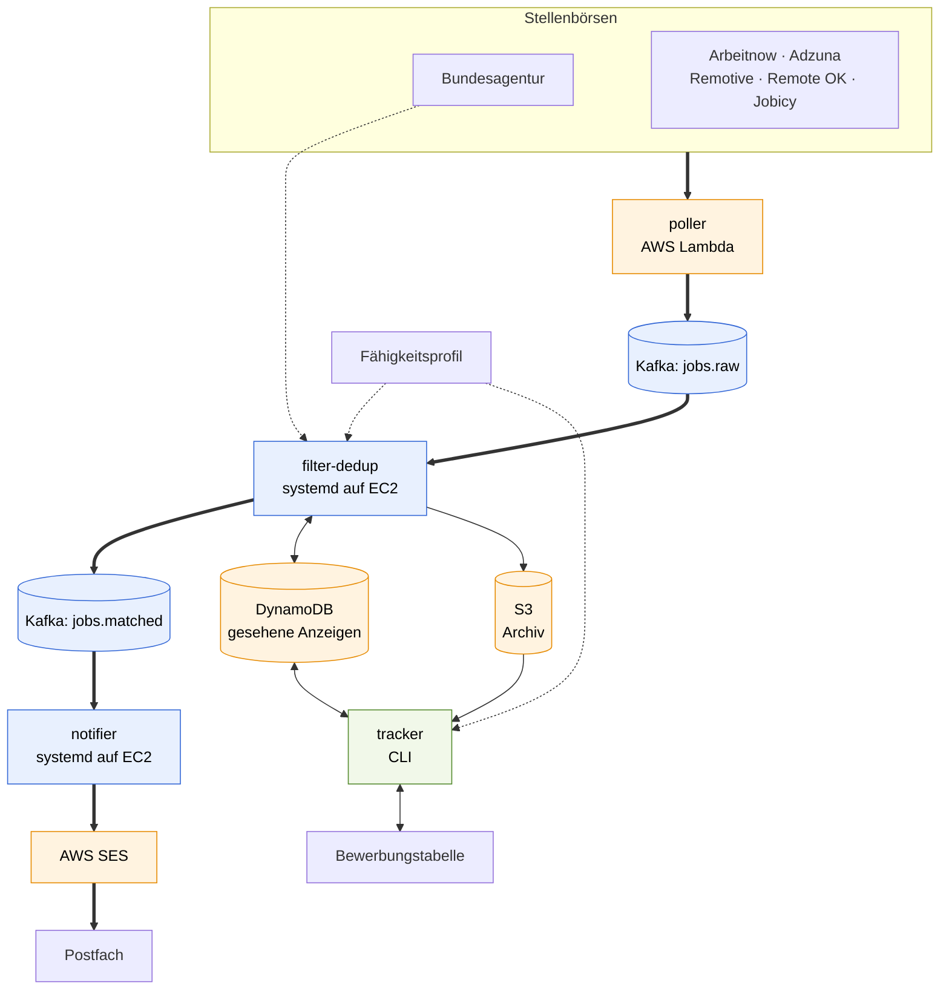
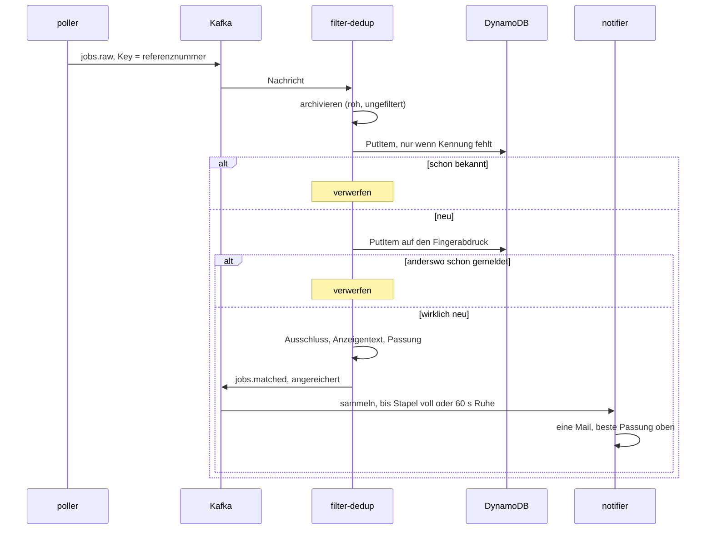
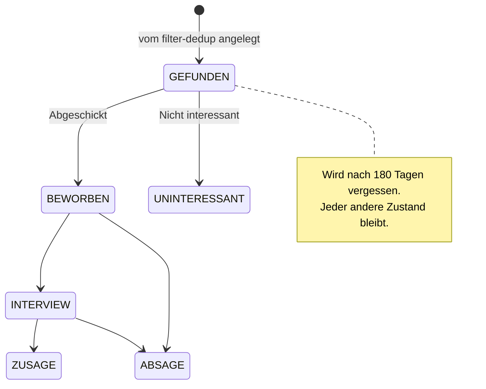

# JobRadar

Event-getriebene Pipeline, die neue Stellenanzeigen aus sechs Börsen
einsammelt, dedupliziert, gegen das eigene Fähigkeitsprofil bewertet und
gebündelt per E-Mail meldet. Dazu ein Bewerbungs-Tracker, der die
Ergebnisse in eine Excel-Tabelle schreibt — und aus ihr zurückliest.

Portfolio- und Lernprojekt für Terraform, Kafka und AWS, gebaut auf einem
Free-Tier-Konto. Alle Befehle, Schalter und Umgebungsvariablen stehen in
[docs/befehle.md](docs/befehle.md); hier steht, **warum** es so gebaut ist.

## Status

| Baustein | Stand |
|----------|-------|
| Terraform: VPC, EC2, DynamoDB, S3, SES, Budget | fertig |
| Kafka 4.x (KRaft) auf t3.micro, SASL_SSL mit eigener CA | fertig |
| `poller` als Lambda, sechs Börsen, alle 10 Stunden | fertig |
| `filter-dedup` und `notifier` als Dienste auf der Instanz | fertig |
| Deduplizierung über Quellen hinweg (Fingerabdruck) | fertig |
| `tracker`: Export, Passung, Status per Auswahlfeld | fertig |
| `tracker rueckblick`: Punktzahl gegen tatsächlichen Ausgang | fertig |
| `tracker trend`: Skill-Trend über das Archiv | fertig |
| `salary-check`: Abgleich mit dem Entgeltatlas | fertig |

338 Tests über sechs Services, alle ohne Netzzugriff lauffähig.

## Architektur



Der Poller läuft **alle zehn Stunden**. Die gestrichelte Linie von der
Bundesagentur zum `filter-dedup` ist der Abruf des Anzeigentextes: ihre
Trefferliste enthält keinen, die übrigen Börsen liefern ihn mit.

Alle AWS-Ressourcen entstehen über Terraform. Single-AZ, ohne NAT Gateway
und ohne Amazon MSK — bewusst, siehe ADR 0002 und 0004.

### Woher die Anzeigen kommen

| Quelle | Bestand | Zugangsdaten |
|--------|---------|--------------|
| `arbeitsagentur` | Hamburg + bundesweit remote | – |
| `adzuna` | Deutschland, Aggregator | kostenlose Registrierung |
| `arbeitnow` | Deutschland | – |
| `jobicy` · `remotive` · `remoteok` | weltweit remote | – |

Je Börse eine Datei in
[`services/poller/poller/quellen/`](services/poller/poller/quellen/).
Alle übersetzen ihr Ergebnis in **das Format der Jobsuche-API**, damit
flussabwärts — Filter, Anreicherung, Mail, Export — nichts unterschieden
werden muss. Eine neue Quelle ist damit genau eine Datei. Fällt eine aus
oder bremst sie mit HTTP 429, macht der Poller mit den übrigen weiter.

Die meisten kennen keine Feldsuche; gefiltert wird nach dem Abruf über
die Suchbegriffe, auf **Teilzeichenketten** — deutsche Titel schreiben
zusammen, und `entwickler` soll auch `Softwareentwickler` finden. Nennt
ein Begriff eine Fähigkeit aus dem Verzeichnis, gilt stattdessen deren
geprüftes Muster: `Java` trifft so nicht `JavaScript`.

**LinkedIn, Indeed, StepStone und get-in-it sind nicht dabei.** Ihre
Nutzungsbedingungen untersagen automatisiertes Auslesen, und sie setzen
das auch durch — ein Scraper wäre ein absehbar gesperrter Poller.
Begründung und verworfene Alternativen in
[ADR 0009](docs/adr/0009-mehrere-stellenboersen.md).

### Dieselbe Stelle auf mehreren Portalen

Die Referenznummer ist nur *innerhalb* einer Quelle eindeutig. Dazu kommt
ein **inhaltlicher Fingerabdruck** aus Arbeitgeber, Titel und Ort:

```
"Data Engineer (m/w/d)"   ≙  "Data Engineer (w/m/d)"
"Beispiel GmbH & Co. KG"  ≙  "Beispiel GmbH"
"20095 Hamburg"           ≙  "Hamburg, Deutschland"
```

Erfahrungsstufen bleiben unterscheidbar: „Senior Data Engineer" ist eine
andere Stelle als „Data Engineer". Geprüft wird im Poller (innerhalb
eines Laufs) und im `filter-dedup` (über Läufe hinweg) — dort als zweiter
bedingter Schreibvorgang gegen dieselbe Tabelle, unter dem Schlüssel
`fp#<abdruck>`. Kein neues Schema, kein zusätzlicher Index.

### Was aussortiert wird

Bei der Bundesagentur sucht der Poller in **zwei Durchgängen**: im
Umkreis von 30 km um Hamburg, und bundesweit für Stellen mit
`homeofficeprozent >= 100`. `NACH_VEREINBARUNG` zählt dabei **nicht** als
remote — der Wert sagt nur, dass darüber zu reden ist
([ADR 0006](docs/adr/0006-bundesweite-remote-stellen.md)).

Anschließend fliegt heraus, wessen Titel einen Ausschlussbegriff enthält:

| Gruppe | Begriffe |
|--------|----------|
| Einstiegsstellen | `praktikum`, `werkstudent`, `ausbildung`, `minijob`, `aushilfe` |
| Erfahrungsstufe | `senior`, `sr` |
| Führungsrollen | `lead`, `teamlead`, `leiter`, `teamleiter`, `principal`, `staff`, `head of` |

Verglichen wird auf den **Wortanfang**. Das ist der Unterschied zwischen
`sr` als Abkürzung für Senior und dem `sr` in „I**sr**ael" — und es sorgt
dafür, dass `praktikum` weiterhin „Praktikumsstelle" erfasst, weil nur
der Anfang gebunden ist. Deshalb stehen `lead` und `teamlead` beide auf
der Liste: in „Teamlead" beginnt kein Wort mit `lead`. Bewusst nicht
dabei ist `manager` — der Begriff steht auch in „Junior Customer Success
Manager".

Die Liste liegt in
[`gemeinsam/ausschluss.py`](services/gemeinsam/gemeinsam/ausschluss.py)
und gilt für **beide** Seiten: was die Mail verschweigt, kommt auch nicht
in die Tabelle.

## Was bei einem Durchlauf passiert



Der Kern ist der **bedingte Schreibvorgang**. Erst `GetItem` und dann
`PutItem` hätte eine Lücke: zwei Consumer könnten dieselbe Anzeige
gleichzeitig für neu halten. Der bedingte Schreibvorgang ist atomar —
schlägt die Bedingung fehl, war die Anzeige bereits erfasst. Derselbe
Mechanismus dient zweimal: einmal für die Kennung, einmal für den
Fingerabdruck.

Offsets werden erst nach erfolgreicher Verarbeitung bestätigt. Stürzt ein
Dienst ab, wird die Nachricht erneut zugestellt; weil die Deduplizierung
eine Wiederholung folgenlos macht, ist das unkritisch.

## Die Bewerbungstabelle

`tracker export` schreibt in eine Excel-Datei — und liest aus ihr zurück.
Die Spalte `Status` ist ein Auswahlfeld, und was dort steht, gilt:

| Auswahl | Wirkung |
|---------|---------|
| *(leer)* | noch nichts entschieden |
| `Abgeschickt` · `Interview` · `Zusage` | nach oben zu den laufenden Bewerbungen |
| `Absage` | ans Ende |
| `Nicht interessant` | verschwindet beim nächsten Export |

Der Export liest die Auswahl **vor** dem Schreiben nach DynamoDB zurück,
sonst überschriebe der Lauf die eigene Eingabe. Ausgeblendete Anzeigen
bleiben gespeichert — sonst tauchte dieselbe Stelle beim nächsten Lauf
wieder auf.



Sortiert wird in drei Blöcken: laufende Bewerbungen zuerst, dann alles
Unberührte nach Passung, ganz unten die Absagen. Jeder Lauf ordnet neu,
die `Nr.` ist der aktuelle Rang.

17 Spalten, alle automatisch gefüllt — handgepflegte gibt es nicht mehr.
Termine von Hand nachzutragen war Arbeit, die niemand macht; was zählt,
nämlich seit wann eine Bewerbung läuft, steht ohnehin in DynamoDB und
beantwortet `tracker faellig`.

Ändert sich der Spaltensatz, **räumt der Export die vorhandene Datei um**
statt einen Neuaufbau zu verlangen. Die Tabelle ist das Eingabefeld; sie
zu verwerfen hieße, Eingaben zu verwerfen.

## Passung zum eigenen Profil

Grundlage ist ein Profil, das aus den eigenen Unterlagen entsteht —
`tracker profil` liest `bewerbung/` und legt die erkannten Begriffe ab.
Liegt es vor, bekommt jede Anzeige vier Spalten: `Passung`, `Punkte`,
`Treffer` und `Lücken`.

| Stufe | ab | Bedeutung |
|-------|----|-----------|
| `A – Volltreffer` | 55 Punkte | deckt den Großteil der Anforderungen |
| `B – Naheliegend` | 35 Punkte | solide Schnittmenge, Lücken schließbar |
| `C – Randbereich` | darunter | wenig Überschneidung |
| `D – zu wenig Angaben` | – | kein Urteil über die Stelle, sondern über die Datenlage |

### Warum die Deckung gedämpft wird

Die Punktzahl ist der Anteil dessen, was die Anzeige verlangt und das
Profil abdeckt — mit einem Zuschlag von 5 im Nenner. Ohne ihn gewann,
wer wenig sagte:

| Deckung | ohne Dämpfung | mit |
|---------|---------------|-----|
| 4 von 4 | 100 | 44 |
| 6 von 8 | 75 | 46 |
| 12 von 15 | 80 | **60** |

Vier von vier genannten Begriffen ergaben glatte 100 und schlugen zwölf
von fünfzehn — genau verkehrt herum, denn die zweite Anzeige sagt mehr
über die Stelle und passt trotzdem. Begriffe im **Titel** zählen
dreifach. Ob ein Treffer einen Schwerpunkt betrifft, geht bewusst nicht
in die Zahl ein; das steht als Stern in der Trefferspalte.

Die Schwellen sind gesetzt, nicht gemessen — und genau dafür gibt es:

### Die Rückkopplung

`tracker rueckblick` stellt die Punktzahl gegen den tatsächlichen Ausgang.
Die einzige Art, die Schwellen zu prüfen statt sie zu behaupten:

```
Punkte    beworben  Interview  Zusage  Absage  offen   Quote
70-100          12          5       1       6      0     50%
55-69           18          3       0      12      3     20%

Als 'Nicht interessant' verworfen: 44, im Schnitt 30 Punkte
Abgeschickt dagegen im Schnitt 51 Punkte
```

Liegt der Schnitt der verworfenen Anzeigen **über** dem der
abgeschickten, misst die Bewertung das Falsche — dann sagt der Befehl das
auch. Gerechnet wird neu statt gespeichert: ändert sich die Formel oder
wächst das Profil, beurteilt der Rückblick die *heutige* Bewertung.

### Das Profil gehört nachgebessert

Eine Mustersuche findet, was dasteht. Ein Lebenslauf erwähnt manches nur
beiläufig, was im Zentrum steht — und schweigt über Dinge, die man längst
kann. Deshalb hat `profil.json` zwei Listen für Eingriffe von Hand:

```json
{ "eigene": ["Kafka", "AWS", "Terraform"], "ausgeschlossen": ["Oracle"] }
```

Wie viel das ausmacht, zeigt eine Data-Engineer-Anzeige gegen einen
Lebenslauf, in dem nichts von dem steht, woraus dieses Repo besteht:

```
Lebenslauf wie er ist      C – Randbereich   Treffer: Python, SQL
+ was in JobRadar steckt   A – Volltreffer   Treffer: Python*, SQL, Kafka*, ETL*, AWS*, Terraform*
```

Das ist weniger eine Aussage über das Werkzeug als über den Lebenslauf.

Gültige Bezeichnungen stehen in
[`gemeinsam/faehigkeiten.py`](services/gemeinsam/gemeinsam/faehigkeiten.py).
Was dort fehlt, ist unsichtbar — deshalb meldet `tracker trend`
zusätzlich Begriffe, die häufig verlangt werden und das Verzeichnis noch
nicht kennt.

### Was den Rechner nicht verlässt

Unterlagen und Profil liegen in `bewerbung/` und sind in `.gitignore` —
das Verzeichnis und zusätzlich die üblichen Dateinamen an jeder Stelle im
Baum, falls doch einmal eine Kopie woanders landet. Ebenso die
ausgefüllte Bewerbungstabelle und der Skill-Trend.

Der Text der Unterlagen wird nur gelesen, nie gespeichert und nie
ausgegeben; in `profil.json` stehen ausschließlich die erkannten
Begriffe. Für die Bewertung in der Mail liegt diese Datei auch auf der
Instanz — eine bewusste Entscheidung, kein Nebeneffekt
([ADR 0007](docs/adr/0007-anreicherung-im-filter-dedup.md)). Lebenslauf
und Zeugnisse bleiben in jedem Fall lokal.

Das Verzeichnis in `faehigkeiten.py` ist davon ausgenommen und gehört ins
Repo: es beschreibt, welche Begriffe es in Stellenanzeigen gibt, nicht
welche auf jemanden zutreffen.

## Die Passung steht in der Mail

Liegt ein Profil auf der Instanz, bewertet der `filter-dedup` jede neue
Anzeige und hängt das Ergebnis an die Nachricht. Der `notifier` stellt es
nur dar — beste Passung zuerst:

```
3 neue Stellenanzeigen:

Fullstack Entwickler Java/React
  A – Volltreffer | 62 Punkte | passt: Java, TypeScript, Spring, React, Docker | fehlt: PostgreSQL
  Arbeitgeber: Nordwerk GmbH
  Ort: 20095 Hamburg (seit 2 Tagen online · 8,2 km)
  https://www.arbeitsagentur.de/jobsuche/jobdetail/10001-…
```

Warum der `filter-dedup` das macht und nicht der `notifier`: dort fällt
der Abruf des Anzeigentextes **einmal je wirklich neuer Anzeige** an —
nicht einmal je Nachricht und nicht einmal je Poller-Lauf. Der Text
landet im selben S3-Zwischenspeicher, aus dem sich später der Export
bedient; der muss deshalb nichts mehr abrufen.

Die Anreicherung ist vollständig gekapselt: fällt die Schnittstelle aus,
geht die Anzeige unbewertet weiter — eine Mail ohne Bewertung ist besser
als keine Mail.

## Skill-Trend

Das Archiv hält jede je gesehene Anzeige, auch die aussortierten. Damit
lässt sich beantworten, was in der Summe gefragt ist:

```
140 Anzeigen ausgewertet, dashboards/skill-trend.html

Was dir am häufigsten fehlt:
   46%    65x  AWS
   38%    53x  Kubernetes
   38%    53x  Terraform
```

Der Nutzen liegt in der Verbindung mit dem Profil. Nicht „AWS steht in
vielen Anzeigen", sondern „AWS fehlt dir in 46 % der Anzeigen" — das eine
ist eine Marktbeobachtung, das andere eine Lernempfehlung. Gezählt wird
**je Anzeige, nicht je Nennung**.

Der Poller sucht in einem Fenster von sieben Tagen, dieselbe Anzeige wird
also mehrfach archiviert. Weil die Referenznummer im Ablageschlüssel
steht, wird zuerst nur die Schlüsselliste gelesen und daraus
dedupliziert; geladen wird nur das erste Vorkommen. In einem Testlauf
über 687 Objekte blieben 140 Abrufe übrig statt 687.

`--hochladen` legt den Bericht im privaten Bucket ab und gibt einen
**sieben Tage gültigen** Link aus. Die Seite ist eine einzelne, in sich
geschlossene HTML-Datei: kein Skript, kein Nachladen, keine externe
Adresse. Ein Diagrammpaket dafür zu laden hieße, sich für ein Rechteck
eine Abhängigkeit einzuhandeln.

## Repo-Struktur

| Pfad | Inhalt |
|------|--------|
| `infra/` | Terraform: `vpc`, `ec2-kafka`, `lambda-poller`, `storage`, `ses`, `budget` |
| `services/poller/` | Lambda: fragt sechs Stellenbörsen ab, published nach Kafka |
| `services/filter-dedup/` | Consumer: Dedup, Archiv, Filter, Anreicherung |
| `services/notifier/` | Consumer: bündelt Treffer, versendet über SES |
| `services/gemeinsam/` | Verzeichnis, Profil, Bewertung, Fingerabdruck, Archivzugriff |
| `services/tracker/` | CLI: Export, Status, Passung, Rückblick, Skill-Trend |
| `services/salary-check/` | CLI: Gehaltsabgleich über den Entgeltatlas |
| `docs/adr/` | Architekturentscheidungen mit Begründung |
| `docs/befehle.md` | Nachschlagewerk: alle Befehle, Schalter und Begriffe |
| `bewerbung/`, `dashboards/` | eigene Unterlagen und Berichte — nicht im Repo |

## Einrichten und Betrieb

Benötigt: Terraform, AWS CLI, Python 3.13.

```bash
cp infra/terraform.tfvars.example infra/terraform.tfvars   # IP und E-Mail eintragen
python services/poller/build.py
terraform -chdir=infra init && terraform -chdir=infra apply
bash scripts/deploy-consumers.sh
```

AWS schickt zwei Bestätigungsmails — eine fürs Budget, eine für die
SES-Adresse. Ohne Quittung bleiben Warnungen und Benachrichtigungen aus.

| Teil | Wo | Auslöser |
|------|----|----------|
| `poller` | Lambda | EventBridge, alle 10 Stunden |
| `filter-dedup` | systemd auf der EC2 | wartet auf `jobs.raw` |
| `notifier` | systemd auf der EC2 | wartet auf `jobs.matched` |

Vollständige Befehlsreferenz samt PowerShell-Fassung:
[docs/befehle.md](docs/befehle.md). Zwei Stolpersteine vorab — die
lokalen Werkzeuge brauchen die **virtuelle Umgebung**, und unter Windows
zeigt `bash` auf das Windows-Subsystem für Linux statt auf Git.

## Kosten

Läuft auf einem Free-Tier-Konto. Die einzige Ressource mit laufenden
Kosten ist die EC2-Instanz.

| Posten | Größenordnung |
|--------|---------------|
| EC2 t3.micro | ca. 8 USD/Monat im Dauerbetrieb |
| EBS 8 GiB gp3 | ca. 0,64 USD/Monat, auch bei gestoppter Instanz |
| Lambda | ~0,02 % des Free-Tier-Kontingents |
| DynamoDB, S3, SES, EventBridge | im Free Tier |

Ein Budget warnt bei 15 USD — bei der Hälfte des tatsächlich Ausgegebenen
und zusätzlich, sobald die Hochrechnung aufs Monatsende das Limit reißt.

Wird gerade nicht daran gearbeitet, gehört die Instanz gestoppt. Die
Consumer stehen dann still, Anzeigen sammeln sich im Topic und werden
beim nächsten Start nachgeholt. Nach dem Start ändert sich die
öffentliche Adresse — einmal `terraform apply` zieht sie nach.

## Entscheidungen

Jede nicht offensichtliche Entscheidung ist mit Begründung und
verworfenen Alternativen dokumentiert:

| ADR | Thema |
|-----|-------|
| [0001](docs/adr/0001-datenquelle-jobsuche-api.md) | Jobsuche-API als Datenquelle, und warum `veroeffentlichtseit` nur 0, 1, 7, 14, 28 akzeptiert |
| [0002](docs/adr/0002-lambda-erreicht-kafka-ohne-nat-gateway.md) | Wie die Lambda den Broker erreicht, ohne 35 USD/Monat für ein NAT Gateway |
| [0003](docs/adr/0003-kafka-authentifizierung-und-zertifikate.md) | SASL/SCRAM und eigene CA mit Wildcard-Zertifikat |
| [0004](docs/adr/0004-consumer-auf-der-instanz.md) | Warum die Consumer nicht in Lambda laufen |
| [0005](docs/adr/0005-gehaltsabgleich-ueber-den-entgeltatlas.md) | Entgeltatlas, veraltete Zugangsdaten und negative Platzhalterwerte |
| [0006](docs/adr/0006-bundesweite-remote-stellen.md) | Bundesweite Remote-Suche, und warum `arbeitszeit=ho` nicht funktioniert |
| [0007](docs/adr/0007-anreicherung-im-filter-dedup.md) | Warum der `filter-dedup` anreichert und nicht der `notifier` |
| [0008](docs/adr/0008-tabelle-nach-passung-sortiert.md) | Tabelle nach Passung sortiert, Gehaltsschätzung raus, Feldname `stellenangebotsBeschreibung` |
| [0009](docs/adr/0009-mehrere-stellenboersen.md) | Sechs Börsen statt einer, warum nicht LinkedIn/Indeed, und der Fingerabdruck |
| [0010](docs/adr/0010-gedaempfte-passung-und-rueckkopplung.md) | Warum die Deckung gedämpft wird und die Tabelle zum Eingabefeld wurde |
| [0011](docs/adr/0011-homeoffice-aus-dem-anzeigentext.md) | Warum „vor Ort" verschwindet, wenn niemand es gesagt hat |

## Datenquellen

| Schnittstelle | Wofür |
|---------------|-------|
| `jobsuche-service/pc/v6/jobs` | Trefferliste der Bundesagentur |
| `.../pc/v4/jobdetails/{base64}` | Anzeigentext, Kontakt, Vergütung |
| `infosysbub/entgeltatlas/.../entgelte/{KldB}` | Gehaltsmedian |
| Adzuna, Arbeitnow, Jobicy, Remotive, Remote OK | offene Job-APIs |

Die Schnittstellen der Bundesagentur sind öffentlich erreichbar, aber
**inoffiziell und ohne Zusage**. Pfade, Feldnamen und Zugangsschlüssel
ändern sich ohne Ankündigung — während der Entwicklung bereits dreimal,
zuletzt das Feld mit dem Anzeigentext. Deshalb wird defensiv abgefragt,
jeder Text nur einmal je Anzeige geholt und nicht im Minutentakt gepollt.

Kein Sprachmodell im Spiel: Passung, Benefits, Kontaktdaten, Homeoffice
und Skill-Trend entstehen ausschließlich durch Feldzuordnung und
Mustersuche. Es fallen keine Kosten je Anzeige an.
