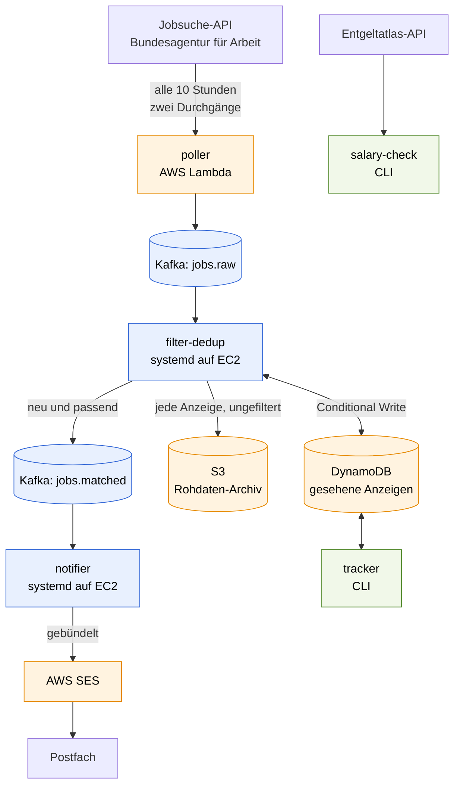
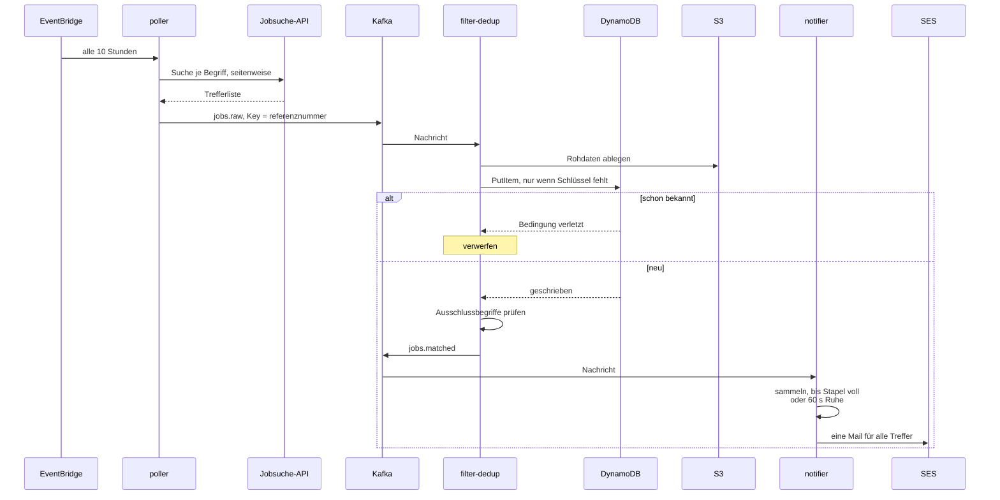
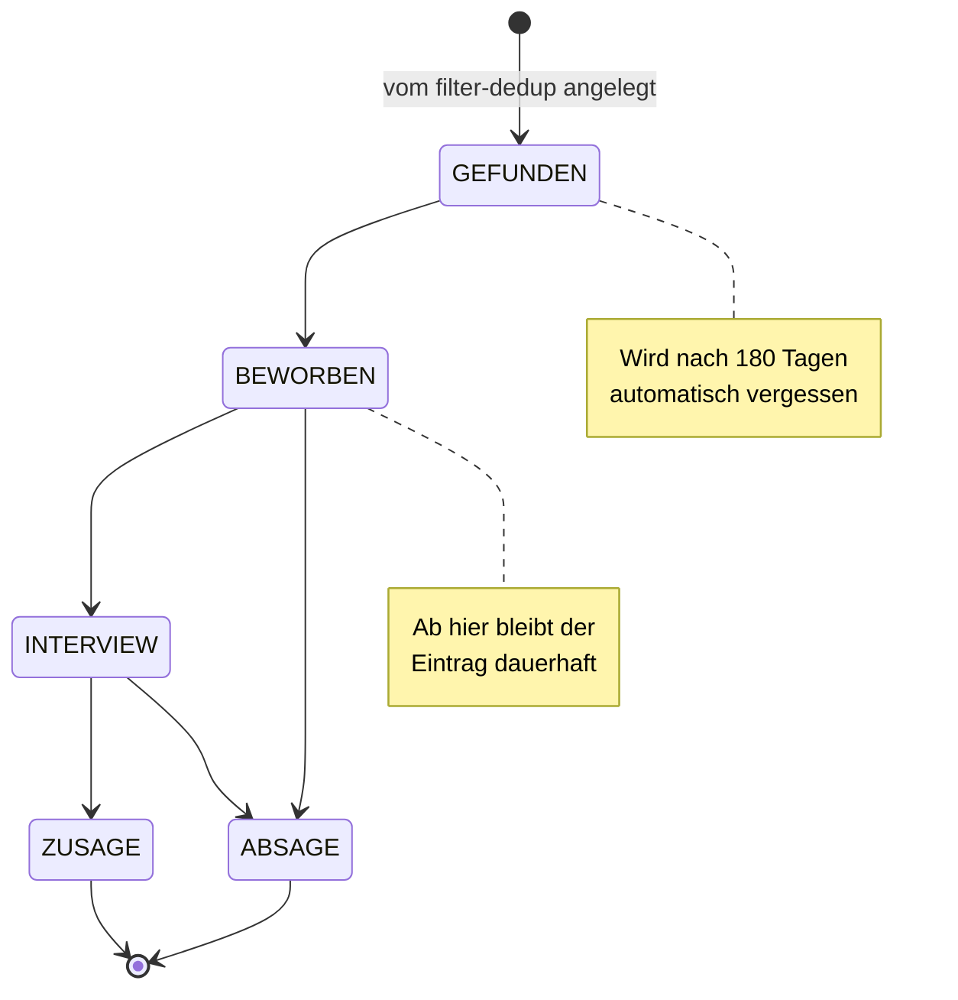

# JobRadar

Event-getriebene Pipeline, die neue Stellenanzeigen im Raum Hamburg
erkennt, dedupliziert und gebündelt per E-Mail meldet. Dazu zwei
Werkzeuge für die Zeit danach: ein Bewerbungs-Tracker und ein
Gehaltsabgleich.

Portfolio- und Lernprojekt für Terraform, Kafka und AWS – gebaut auf
einem Free-Tier-Konto, mit entsprechend bewussten Entscheidungen bei
jeder Ressource.

## Status

Die Pipeline läuft durchgängig von der API bis zur E-Mail.

| Baustein | Stand |
|----------|-------|
| Terraform: VPC, EC2, DynamoDB, S3, SES, Budget | fertig |
| Kafka 4.x (KRaft) auf t3.micro, SASL_SSL mit eigener CA | fertig |
| `poller` als Lambda, alle 10 Stunden | fertig |
| `filter-dedup` und `notifier` als Dienste auf der Instanz | fertig |
| `tracker`: Bewerbungsstatus verwalten | fertig |
| `salary-check`: Abgleich mit dem Entgeltatlas | fertig |
| Skill-Trend-Dashboard | offen |

68 Tests über fünf Services, alle ohne Netzzugriff lauffähig.

## Architektur



Alle AWS-Ressourcen entstehen über Terraform. Das Setup ist bewusst
Single-AZ, ohne NAT Gateway und ohne Amazon MSK.

### Was gesucht und was aussortiert wird

Der Poller sucht in **zwei Durchgängen**:

1. **Im Umkreis von Hamburg** (30 km), unabhängig davon, ob Homeoffice
   angeboten wird.
2. **Bundesweit**, aber nur Anzeigen mit `homeofficeprozent >= 100` –
   also solche, die vollständig aus dem Homeoffice zu erledigen sind.
   Dort spielt der Arbeitsort keine Rolle.

Gepollt wird **alle zehn Stunden**. Bei rund anderthalb neuen Anzeigen
pro Tag reicht das aus und schont eine Schnittstelle, hinter der kein
Vertrag steht. Das Suchfenster von sieben Tagen liegt weit darüber – ein
ausgefallener Lauf geht also nicht verloren.

`homeofficetyp: NACH_VEREINBARUNG` zählt dabei **nicht** als remote. Der
Wert sagt nur, dass darüber gesprochen werden kann; für eine Stelle am
anderen Ende der Republik ist das keine Grundlage. Details in
[ADR 0006](docs/adr/0006-bundesweite-remote-stellen.md).

Anschließend wirft der `filter-dedup` alles heraus, dessen Titel oder
Berufsbezeichnung einen Ausschlussbegriff enthält. Voreingestellt sind
drei Gruppen:

| Gruppe | Begriffe |
|--------|----------|
| Einstiegsstellen | `praktikum`, `werkstudent`, `ausbildung`, `minijob`, `aushilfe`, `schulpraktikum` |
| Erfahrungsstufe | `senior`, `sr` |
| Führungsrollen | `lead`, `teamlead`, `leiter`, `teamleiter`, `principal`, `staff`, `head of` |

Verglichen wird auf den **Wortanfang**, nicht irgendwo im Text. Das ist
der Unterschied zwischen „`sr`" als Abkürzung für Senior und dem `sr` in
„I**sr**ael" – und es sorgt zugleich dafür, dass `praktikum` weiterhin
auch „Praktikumsstelle" erfasst, weil nur der Wortanfang gebunden ist.

Deshalb stehen `lead` und `teamlead` beide auf der Liste: In „Teamlead"
beginnt kein Wort mit `lead`. Bewusst **nicht** dabei ist `manager` – der
Begriff kommt auch in „Junior Customer Success Manager" vor und würde
Einstiegsstellen aussortieren.

Zu ändern in `scripts/deploy-consumers.sh` über `MATCH_AUSSCHLUSS`.
Optional lässt sich mit `MATCH_PFLICHT` zusätzlich verlangen, dass
mindestens einer von mehreren Begriffen vorkommt.

## Was bei einem Durchlauf passiert



Der entscheidende Schritt ist der bedingte Schreibvorgang gegen
DynamoDB. Erst `GetItem` und dann `PutItem` hätte eine Lücke: zwei
Consumer könnten dieselbe Anzeige gleichzeitig für neu halten. Der
bedingte Schreibvorgang ist atomar – schlägt die Bedingung fehl, war die
Anzeige bereits erfasst.

Offsets werden erst nach erfolgreicher Verarbeitung bestätigt. Stürzt
ein Dienst ab, wird die Nachricht erneut zugestellt; weil die
Deduplizierung eine Wiederholung folgenlos macht, ist das unkritisch.

## Repo-Struktur

| Pfad | Inhalt |
|------|--------|
| `infra/` | Terraform: `vpc`, `ec2-kafka`, `lambda-poller`, `storage`, `ses`, `budget` |
| `services/poller/` | Lambda: fragt die Jobsuche-API ab, published nach Kafka |
| `services/filter-dedup/` | Consumer: Dedup gegen DynamoDB, Archiv nach S3, Filter |
| `services/notifier/` | Consumer: bündelt Treffer, versendet über SES |
| `services/tracker/` | CLI: Bewerbungsstatus verwalten |
| `services/salary-check/` | CLI: Gehaltsabgleich über den Entgeltatlas |
| `scripts/` | Ausrollen der Consumer auf die Instanz |
| `docs/adr/` | Architekturentscheidungen mit Begründung |

## Einrichten

Benötigt: Terraform, AWS CLI, Python 3.13.

```bash
cp infra/terraform.tfvars.example infra/terraform.tfvars
```

Darin gehören die eigene öffentliche IP (`curl -s https://checkip.amazonaws.com`)
für den SSH-Zugang und die E-Mail-Adresse für Budget-Warnungen und
Benachrichtigungen. Dann:

```bash
python services/poller/build.py          # Lambda-Paket bauen
terraform -chdir=infra init
terraform -chdir=infra apply
bash scripts/deploy-consumers.sh         # Consumer auf die Instanz
```

AWS schickt zwei Bestätigungsmails – eine für das Budget, eine für die
SES-Adresse. Beide müssen quittiert werden, sonst bleiben Warnungen und
Benachrichtigungen aus.

## Betrieb

| Teil | Wo | Auslöser |
|------|----|----------|
| `poller` | Lambda | EventBridge, alle 10 Stunden |
| `filter-dedup` | systemd auf der EC2 | wartet auf `jobs.raw` |
| `notifier` | systemd auf der EC2 | wartet auf `jobs.matched` |

```bash
# Dienste beobachten
ssh ec2-user@$(terraform -chdir=infra output -raw kafka_public_dns)
sudo journalctl -u jobradar-filter-dedup -f

# Poller von Hand auslösen
aws lambda invoke --function-name jobradar-poller antwort.json
aws logs tail /aws/lambda/jobradar-poller --since 10m --format short

# nach einer Codeänderung
bash scripts/deploy-consumers.sh                     # Consumer
python services/poller/build.py && terraform -chdir=infra apply   # Poller
```

Tests laufen ohne Netzzugriff, je Service einzeln:

```bash
python -m pytest services/poller
python -m pytest services/filter-dedup
```

## Bewerbungen verfolgen

Der Tracker arbeitet auf derselben DynamoDB-Tabelle, in die der
Dedup-Schritt jede gefundene Anzeige schreibt.



```bash
export DYNAMODB_TABLE_SEEN_JOBS=$(terraform -chdir=infra output -raw dedup_table_name)
cd services/tracker

python -m tracker.main liste
python -m tracker.main liste --status BEWORBEN
python -m tracker.main zeige 10001-1003552327-S
python -m tracker.main setze 10001-1003552327-S BEWORBEN
```

Sobald eine Anzeige den Zustand `GEFUNDEN` verlässt, wird ihre
Aufbewahrungsfrist aufgehoben. Eine laufende Bewerbung soll nicht nach
180 Tagen still aus der Tabelle verschwinden, während reine Fundstücke
sich weiterhin selbst abräumen.

## Gehalt einordnen

```bash
cd services/salary-check

python -m salary_check.main --titel "Junior Data Engineer"
python -m salary_check.main --titel "Data Engineer"
python -m salary_check.main --kldb 43413 --region deutschland
```

```
Junior Data Engineer -> KldB 43412
Fachkraft in Hamburg
  Median              4776 EUR brutto im Monat
  Mittlere Haelfte    3845 bis 6244 EUR
  Datenbasis           643 Beschaeftigte
```

Ohne Zusatz im Titel landet dieselbe Suche eine Stufe höher:

```
Data Engineer -> KldB 43413
Spezialist in Hamburg
  Median              6461 EUR brutto im Monat
  Mittlere Haelfte    5382 bis 7565 EUR
  Datenbasis          2008 Beschaeftigte
```

Die letzte Ziffer des Schlüssels ist das Anforderungsniveau: `2`
Fachkraft, `3` Spezialist, `4` Experte. Das Werkzeug leitet sie aus dem
Titel ab – „Junior" oder „Trainee" ergeben Fachkraft, ohne Hinweis wird
Spezialist angenommen.

Grundlage ist der Entgeltatlas der Bundesagentur. Die Zuordnung vom
Stellentitel zum Berufsschlüssel ist eine Heuristik, die Zahlen sind
Mediane über eine ganze Berufsgruppe in einem Bundesland – ein
Anhaltspunkt, keine Aussage über die konkrete Stelle.

## Kosten

Das Projekt läuft auf einem Free-Tier-Konto. Die einzige Ressource mit
laufenden Kosten ist die EC2-Instanz.

| Posten | Größenordnung |
|--------|---------------|
| EC2 t3.micro | ca. 8 USD/Monat im Dauerbetrieb |
| EBS 8 GiB gp3 | ca. 0,64 USD/Monat, auch bei gestoppter Instanz |
| Lambda | ~0,02 % des Free-Tier-Kontingents |
| DynamoDB, S3, SES, EventBridge, Budgets | im Free Tier |

Ein Budget warnt bei 15 USD – bei der Hälfte des tatsächlich
Ausgegebenen und zusätzlich, sobald die Hochrechnung aufs Monatsende das
Limit reißt.

Wenn gerade nicht daran gearbeitet wird, gehört die Instanz gestoppt:

```bash
aws ec2 stop-instances --instance-ids $(terraform -chdir=infra output -raw kafka_instance_id)
```

Die Consumer stehen dann still, Anzeigen sammeln sich im Topic und
werden beim nächsten Start nachgeholt. Nach dem Start ändert sich die
öffentliche Adresse – einmal `terraform apply` zieht sie in die
Lambda-Konfiguration nach, `bash scripts/deploy-consumers.sh` in die der
Consumer. Der Broker selbst konfiguriert sich beim Booten von allein neu.

Das Betriebssystem-Image wird bewusst nicht automatisch erneuert. Sonst
würde Terraform die Instanz bei jedem neuen Amazon-Linux-Release
ersetzen. Ein Wechsel ist eine bewusste Entscheidung:

```bash
terraform -chdir=infra apply -replace=module.ec2_kafka.aws_instance.kafka
```

## Entscheidungen

Jede nicht offensichtliche Entscheidung ist mit Begründung und
verworfenen Alternativen dokumentiert:

| ADR | Thema |
|-----|-------|
| [0001](docs/adr/0001-datenquelle-jobsuche-api.md) | Jobsuche-API als Datenquelle, und warum `veroeffentlichtseit` nur 0, 1, 7, 14, 28 akzeptiert |
| [0002](docs/adr/0002-lambda-erreicht-kafka-ohne-nat-gateway.md) | Wie die Lambda den Broker erreicht, ohne 35 USD/Monat für ein NAT Gateway |
| [0003](docs/adr/0003-kafka-authentifizierung-und-zertifikate.md) | SASL/SCRAM und eigene CA mit Wildcard-Zertifikat |
| [0004](docs/adr/0004-consumer-auf-der-instanz.md) | Warum die Consumer nicht in Lambda laufen |
| [0005](docs/adr/0005-gehaltsabgleich-ueber-den-entgeltatlas.md) | Entgeltatlas, veraltete Zugangsdaten und negative Platzhalterwerte |
| [0006](docs/adr/0006-bundesweite-remote-stellen.md) | Bundesweite Remote-Suche, und warum `arbeitszeit=ho` nicht funktioniert |

## Datenquellen

Beide Schnittstellen der Bundesagentur für Arbeit sind öffentlich
erreichbar, aber inoffiziell und ohne Zusage. Pfade, Feldnamen und
Zugangsschlüssel ändern sich ohne Ankündigung – bereits zweimal während
der Entwicklung. Deshalb wird defensiv abgefragt und nicht im
Minutentakt.

Bewusst kein Scraping gegen StepStone, Indeed oder LinkedIn: das
verletzt deren Nutzungsbedingungen.
